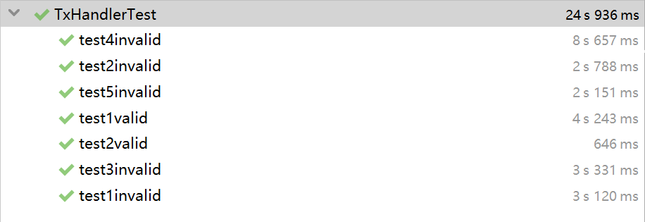

# Homework 1：Scrooge Coin

Name：玻澜

Student_ID:   1901212560

## Background

In this homework, we will implement the Scrooge Coin, where the central authority Scrooge receives transactions from users. I will implement the logic used by Scrooge to process transactions and produce the ledger. Scrooge organizes transactions into time periods or
blocks. In each block, Scrooge will receive a list of transactions, validate the transactions he receives, and publish a list of validated transactions.

## Summary of the Solution

### 1.Implement of TxHandler

#### 1.1 public TxHandler(UTXOPool utxoPool);

First claim a private utxopool, then create a new one in this public function.

#### 1.2 public boolean isValidTx(Transaction tx)

In terms of every transaction,  check 5 conditions to judge whether it is a valid transaction: Returns true if

* (1) all outputs claimed by tx are in the current UTXO pool,
* (2) the signatures on each input of tx are valid,
* (3) no UTXO is claimed multiple times by tx,
* (4) all of tx’s output values are non-negative, and
* (5) the sum of tx’s input values is greater than or equal to the sum of
  its output values; and false otherwise.

#### 1.3 public Transaction[] handleTxs(Transaction[] possibleTxs)

We know that transactions can’t be validated in isolation and it is a tricky problem to choose a subset of transactions that are together valid. In this function,  we check all transactions for loop until no new transaction is valid. As a result, we return the valid transaction list.

Remark：public void Txsign(PrivateKey sk, int input) is designed in class Transaction so that we can get signature easily.

### 2. Junit Test

I designed kinds of transactions including valid ones and invalid ones, which are used in test suite to proof the accuracy of the implement of Txhandler.java.  Details are shown below.

## Design of the test suite

First of all,  5 accounts A B C D E are created and I create 10 and 5 coins for A and B respectively. Besides, 7 test suites, including 2 for validation test and 5 for invalidation test have been generated in TxhandlerTest.java :

### valid test：

##### 1.public void test1valid()

- Purpose： To verify a single valid transaction.
- Case:   <u>A --> B   2 coins</u>

##### 2.public void test2valid()

- Purpose： To verify the validation of a set of transactions including multiple inputs or multiple outputs.

- Case:   

  <u>A --> B   2 coins</u>

  <u>B --> C    5 coins       B -->D  1coin</u>

  <u>C --> E     2 coins       D -->E  1coin</u>

### invalid test：

##### 1.public void test1invalid()

- Purpose： To test a transaction whose previous output claimed is not in the current UTXO pool.
- Case:   <u>C --> D   2 coins</u>   where  C  does not  have coins in UTXO.

##### 2.public void test2invalid()

- Purpose： To test a transaction with a wrong signature.
- Case:   <u>A --> B   2 coins</u>   where  C try to use its private key to spend A's coin.

##### 3.public void test3invalid()

- Purpose： To test a transaction with a negative output value.
- Case:   <u>A--> B   -2 coins</u>.

##### 4.public void test4invalid()

- Purpose： To test a transaction whose input value is less than output value.
- Case:   <u>A--> B   20 coins</u>.

##### 5.public void test5invalid()

- Purpose： To invalidate the transaction which is double- spending.

- Case:   

  <u>A --> B    2 coins</u>

  <u>B --> C    2 coins</u>

  <u>C --> D    2coins</u>

  <u>A --> E    2coins</u>   double - spending attack

## Results

All tests pass.

