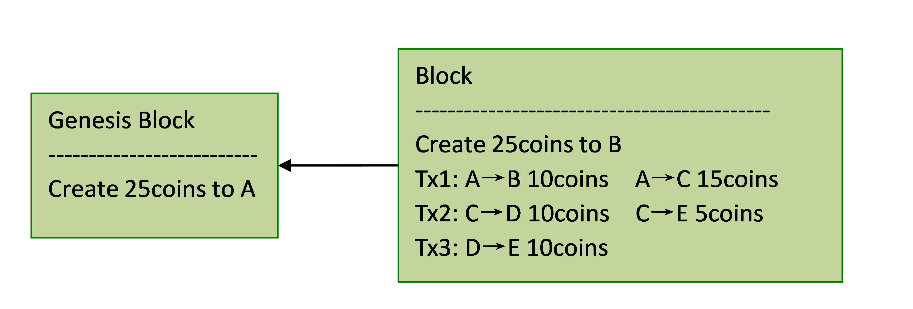
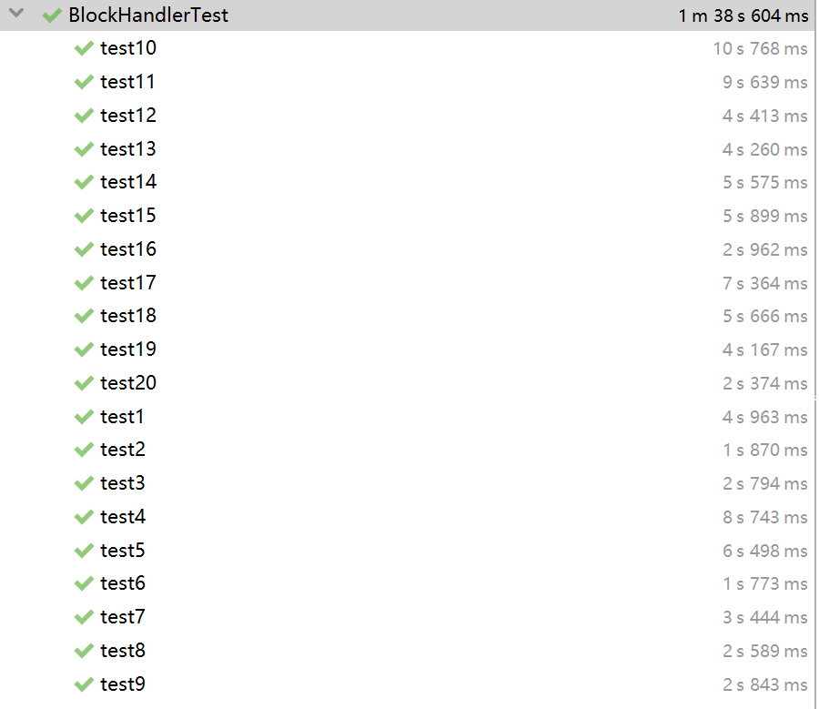

# Homework 2：Block Chain

Name：玻澜

Student_ID:   1901212560

## Background

In this homework we will implement a node that’s part of a block-chain-based distributed consensus protocol. Specifically, the code will receive incoming transactions and blocks and maintain an updated block chain.

## Summary of the Solution

### 1.Implement of BlockChain

First we create a private class **BlockNode** to include more related information about block in a block chain so that we can establish a block chain easily. Besides, we create some other private members, **blockChainmap** which records the map between hash values and blocknodes, **height** which records the height of the block chain, **maxHeightNode** which records the top block node in the currrent block chain and **txpool** which records the transactions not processed in current blockChain.

#### 1.1 public BlockChain(Block genesisBlock);

step1: Create an empty blockchainmap, an empty transaction pool and an empty UTXO pool.

step2: Add the coinbase transaction to UTXO pool

step3: Append the genesis block to the blockchain then set the genesis block as maxHeightNode.

#### 1.2 public Block getMaxHeightBlock()

return the block of maxHeightNode.

#### 1.3 public UTXOPool getMaxHeightUTXOPool()

return the UTXOPool of maxHeightNode.

#### 1.4 public TransactionPool getTransactionPool()

return txpool.

#### 1.5 public boolean addBlock(Block block)

step1: Check the validity of block. 

- the hash of parent node cannot be null.
- the parent node must be exist in the block chain.

step2: Check validity of transactions in the block. If there is any invalid transactions, return false.

step3: Add the coinbase of current block to UTXOPool.

step4: Append current block to the blockchain and update the height of blockchain.

step5: Update the transaction pool, removing transactions used by the current block.

step6: Check the height satisfying height > (maxHeight - CUT_OFF_AGE).

#### 1.6 public void addTransaction(Transaction tx)

Add transactions to txpool.

### 2. Junit Test

I designed kinds of blocks including valid ones and invalid ones, which are used in test suite to proof the accuracy of the implement of BlockChain.java and BlockHandler.java.  Details are shown below.

## Design of the test suite

First of all,  5 accounts A B C D E are created. Besides, 20 test suites, including 10 to test  function public boolean processBlock(Block block) and the other 10 to test function public Block createBlock(PublicKey myAddress) have been generated in BlockHandlerTest.java :

### processBlock(Block block) test：

##### 1.test1:

- Purpose：To add a no transaction block on the top of genesisi block.

  

##### 2.test2:

- Purpose： To add another genesis block, which is invalid.

  

##### 3.test3:

- Purpose： Try to add  a block with invalid prevhash.

##### 4.test4:

- Purpose： To add a block with a valid transaction.

##### 5.test5:

- Purpose： To add a block with some valid transactions.

##### 6.test6:

- Purpose： Try to add a block with a double spending transaction.

##### 7.test7:

- Purpose： Try to add a block with some invalid transactions, such as negative input, wrong signature, invalid utxo and insufficient coins. The result is that we fail to add such blocks.

##### 8.test8:

- Purpose： To add multiple blocks directly on the top of the genesis block.

##### 9.test9:

- Purpose： To process a chain of block with the method of loop automatically.

##### 10.test10:

- Purpose： To process a block by forking with a utxo which has been claimed in the longest chain.

##### 11.test11:

- Purpose： To process a block whose height > maxheight- cut off age.

##### 12.test12:

- Purpose： To process a block whose height < = maxheight- cut off age.

### createBlock(PublicKey myAddress) test：

##### 1.test13:

- Purpose： To create a block when there is no transaction in transaction pool.

##### 2.test14:

- Purpose： To create a block when there is a valid transaction in transaction pool. The created block will include the valid transaction.

##### 3.test15:

- Purpose： To create a block when there is an invalid transaction in transaction pool. The created block will not include the valid transaction.

##### 4.test16:

- Purpose： To create a block with a valid utxo and an invalid utxo that has been claimed in previous block.

  

##### 5.test17:

- Purpose： To create a block chain with the method of loop automatically.

##### 6.test18:

- Purpose： To process multiple blocks at same height, then create a block on top of the oldest block.

##### 7.test19:

- Purpose： Create a block, check the block is on the top of highest chain.

##### 8.test20:

- Purpose： To create a block with a utxo which has been claimed in other chain.

## Results

All tests pass.

